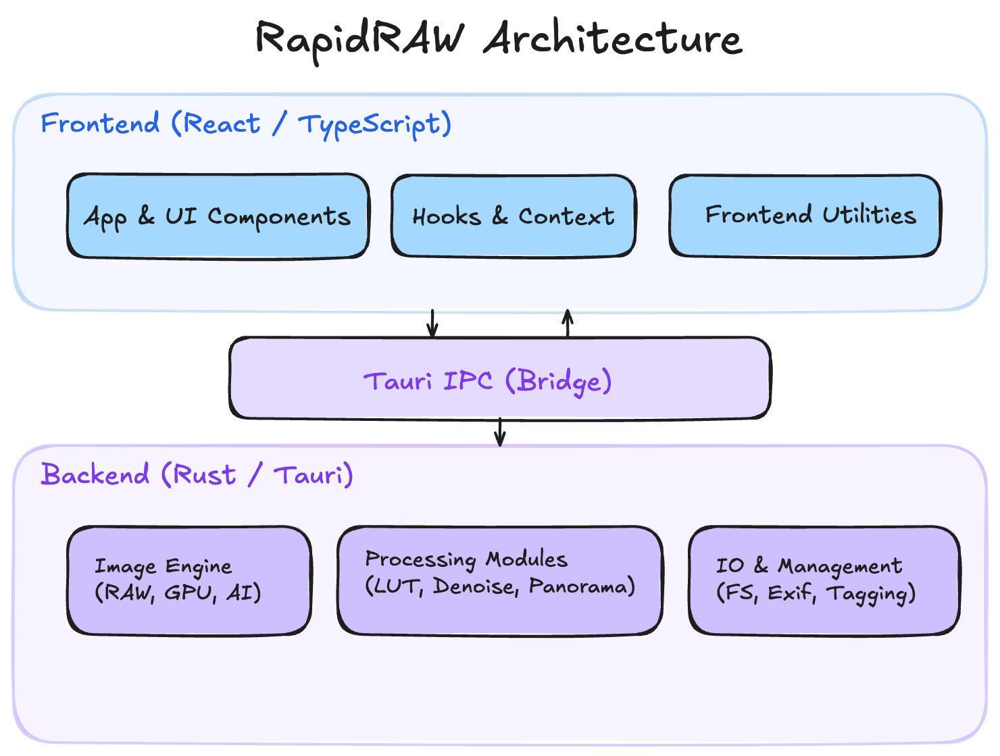

# RapidRAW — Developer Guide

---

## Development Environment Setup

### Prerequisites

| Tool | Version | Notes |
|------|---------|-------|
| **Rust** | 1.94.0 (pinned via `../src-tauri/rust-toolchain.toml`) | Install via [rustup](https://rustup.rs/) |
| **Node.js** | ≥ 18 LTS | For the React frontend |

### Platform Dependencies

**macOS:** `xcode-select --install`

**Linux:**
```bash
sudo apt-get install -y libwebkit2gtk-4.1-dev libssl-dev \
    libayatana-appindicator3-dev librsvg2-dev
```

**Windows:** [Visual Studio Build Tools](https://visualstudio.microsoft.com/visual-cpp-build-tools/) with "Desktop development with C++"

### First Run

```bash
git clone https://github.com/CyberTimon/RapidRAW.git && cd RapidRAW
npm install
npm start   # runs `tauri dev` — launches Vite on :1420 + compiles Rust backend
```

> **Note:** First build takes **5–10 minutes** (large Rust dependency tree). The build script also auto-downloads the ONNX Runtime binary for your platform via `../src-tauri/build.rs`. Incremental rebuilds are fast.

---

## Architecture Overview



All mutable backend state lives in a single `AppState` struct (in `../src-tauri/src/lib.rs`), accessed via `tauri::State<AppState>`. Key fields include caches for the loaded image, GPU textures, masks, LUTs, and AI models — all behind `Mutex` or `Arc`.

---

## Project Structure

```
../src/                           # FRONTEND
├── App.tsx                       # Root component (~202KB — manages nearly all state)
├── components/
│   ├── adjustments/              # Slider UIs: Basic, Color, Curves, Details, Effects
│   ├── modals/                   # Dialogs: export, panorama, HDR, denoise, etc.
│   ├── panel/
│   │   ├── Editor.tsx            # Main editor layout
│   │   ├── MainLibrary.tsx       # Library grid view
│   │   ├── editor/
│   │   │   ├── ImageCanvas.tsx   # Core image display + zoom/pan
│   │   │   └── Waveform.tsx      # Histogram / waveform / vectorscope
│   │   └── right/                # Right panel tabs: Controls, Masks, AI, Presets, Export, Crop, Metadata
│   └── ui/                       # Reusable primitives: Slider, Button, ColorWheel, etc.
├── hooks/                        # useHistoryState, useKeyboardShortcuts, usePresets, etc.
├── utils/
│   ├── adjustments.tsx           # ⭐ Adjustment types, interfaces & defaults
│   ├── frontendLogBridge.ts      # Forwards console.* → Rust log file
│   └── themes.tsx, ImageLRUCache.ts, etc.
└── context/                      # Right-click context menus

../src-tauri/src/                 # BACKEND
├── lib.rs                        # ⭐ Core: AppState, all Tauri commands, app builder
├── gpu_processing.rs             # wgpu device init, compute pipeline dispatch
├── image_processing.rs           # CPU transforms, AllAdjustments repr(C) struct
├── file_management.rs            # File I/O, sidecars, thumbnails, presets
├── ai_processing.rs              # ONNX inference (SAM2, U2Net, CLIP, LaMa, DepthAnything)
├── mask_generation.rs            # Mask bitmap generation from definitions
├── raw_processing.rs             # rawler RAW → DynamicImage
├── exif_processing.rs            # EXIF metadata extraction
├── lens_correction.rs            # Lensfun database & correction
├── denoising.rs, tagging.rs, culling.rs, etc.
└── shaders/
    ├── shader.wgsl               # ⭐ Main image processing shader (61KB)
    ├── blur.wgsl                 # Gaussian blur compute shader
    └── flare.wgsl                # Lens flare effect
```

---

## How an Edit Works (Data Flow)

1. User drags a slider → React updates adjustment state in `../src/App.tsx`
2. `invoke('apply_adjustments', { adjustments })` sends JSON to Rust
3. Rust checks transform hash — **reuses cached transformed image** if crop/rotate/flip unchanged
4. Adjustment JSON is deserialized into `AllAdjustments` (a `repr(C)` struct) and uploaded as a GPU uniform buffer
5. wgpu dispatches the compute shader, which processes all adjustments in one pass
6. Resulting RGBA8 pixels are read back and JPEG-encoded for the frontend

The adjustment model exists in **three synced layers**:

| Layer | File | Format |
|-------|------|--------|
| Frontend | `../src/utils/adjustments.tsx` | TypeScript `Adjustments` interface |
| Backend | `../src-tauri/src/image_processing.rs` | `AllAdjustments` `#[repr(C)]` struct |
| GPU | `../src-tauri/src/shaders/shader.wgsl` | WGSL uniform struct |

> **Important:** Adding a new adjustment requires changes in **all three layers**, with correct `repr(C)` alignment in the Rust struct.

---

## Caching

Performance comes from aggressive caching — when only visual params change, the expensive transform step is skipped:

| Cache | Key | Stores |
|-------|-----|--------|
| `full_transformed_cache` | transform hash | Full-res image post-crop/rotate/flip/warp |
| `gpu_image_cache` | — | GPU texture of current source image |
| `mask_cache` | mask definition hash | Generated mask bitmaps |
| `patch_cache` | patch ID | AI inpainting data (avoids re-sending large blobs) |
| `lut_cache` | file path | Parsed LUT data |
| `ImageLRUCache` (frontend) | image path | Recently viewed preview images |

---

## Linting & CI

```bash
# Frontend
npm run lint          # ESLint
npm run format:check  # Prettier

# Backend (from src-tauri/)
cargo fmt --check
cargo clippy --all-targets --all-features -- -D warnings
```

CI runs on every push to `main` and every PR — full build matrix across Windows (x64/ARM), macOS (x64/ARM), Ubuntu (22.04/24.04, x64/ARM), and Android.

---

## Common Recipes

### Add a New Slider

1. Add property + default to `Adjustments` / `INITIAL_ADJUSTMENTS` in `../src/utils/adjustments.tsx`
2. Add `<Slider>` in the appropriate section component (e.g., `../src/components/adjustments/Basic.tsx`)
3. Add field to `AllAdjustments` in `../src-tauri/src/image_processing.rs` (watch alignment!)
4. Add uniform field + processing logic in `../src-tauri/src/shaders/shader.wgsl`
5. Handle backwards compat via `??` in `normalizeLoadedAdjustments`

### Add a New Tauri Command

1. Write `#[tauri::command]` function in the appropriate `.rs` module
2. Register in the `invoke_handler` at the bottom of `../src-tauri/src/lib.rs`
3. Call from frontend: `invoke('command_name', { ...args })`

### Debugging

- **Frontend DevTools:** `Cmd+Shift+I` (macOS) / `Ctrl+Shift+I` (Windows/Linux) inside the Tauri window
- **Backend logs:** `~/.config/RapidRAW/logs/` — all frontend `console.*` calls are also forwarded here via `../src/utils/frontendLogBridge.ts`
- **GPU backend issues:** Set `WGPU_BACKEND=metal|vulkan|dx12` env var before running
